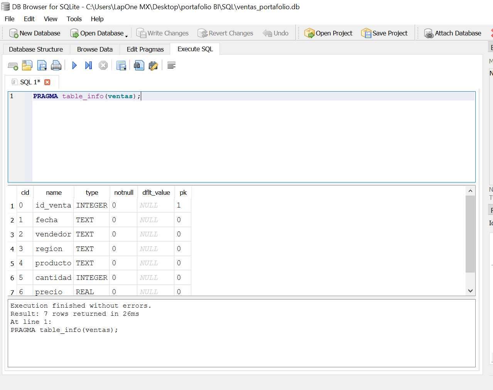
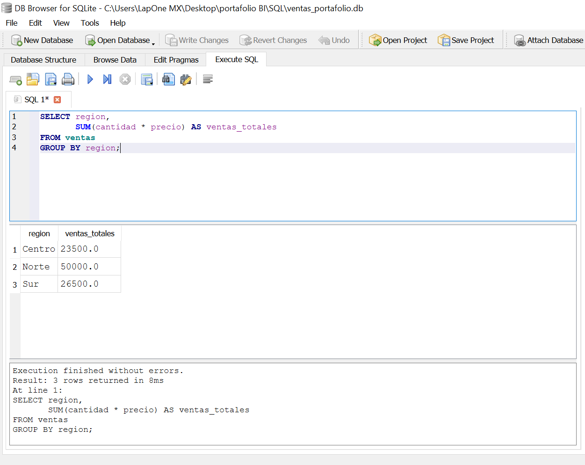
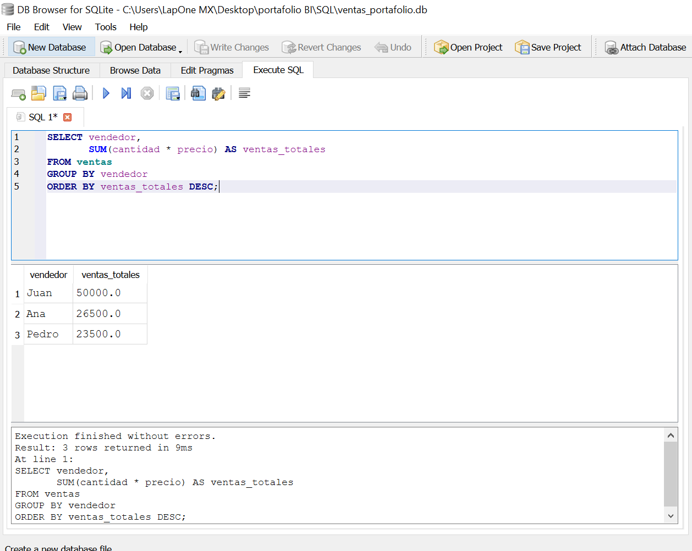
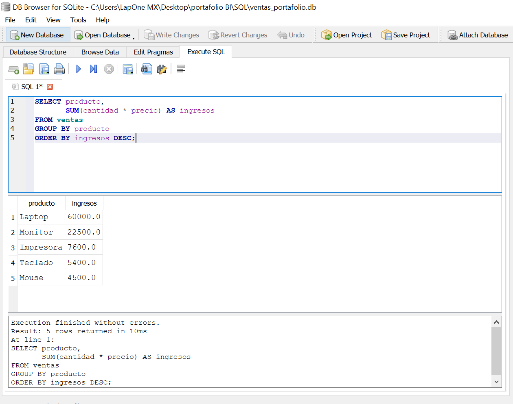
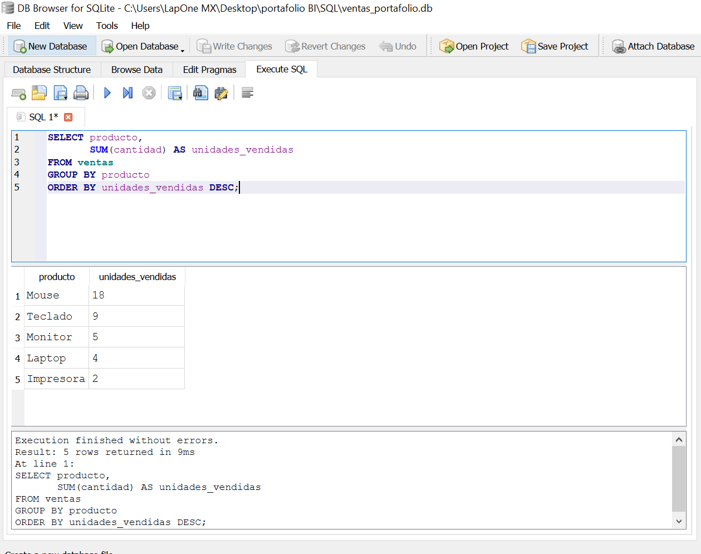
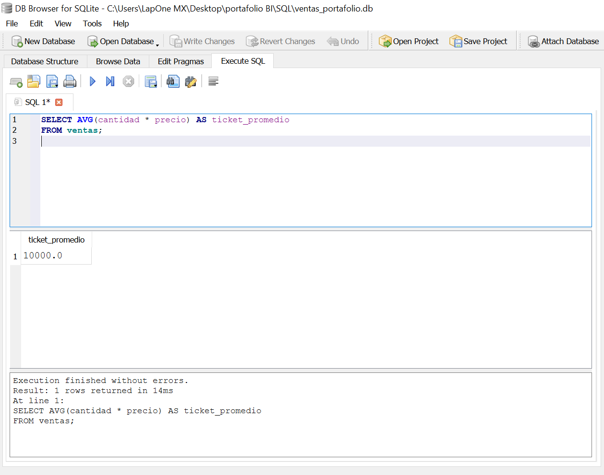
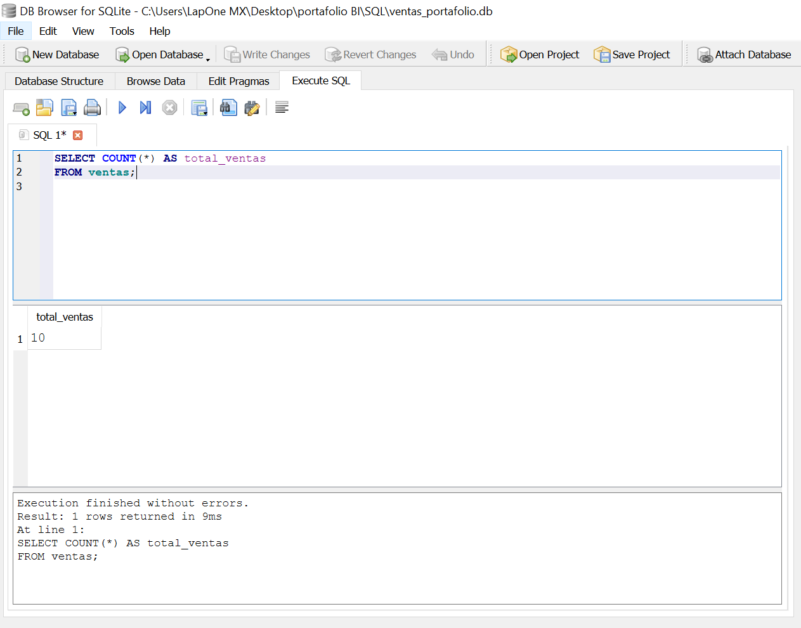
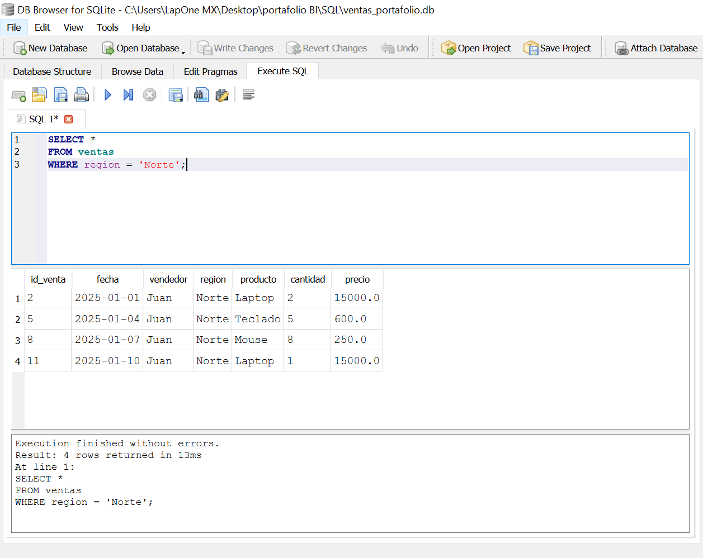
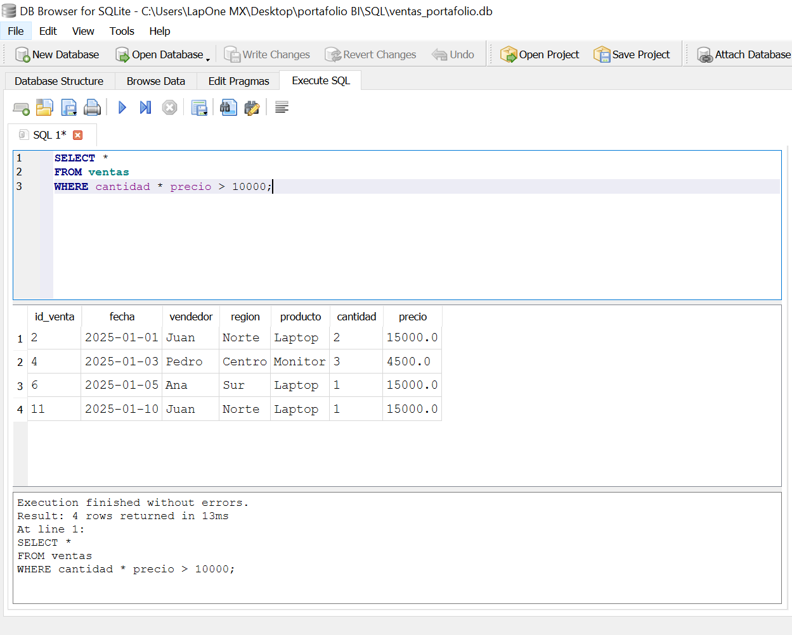
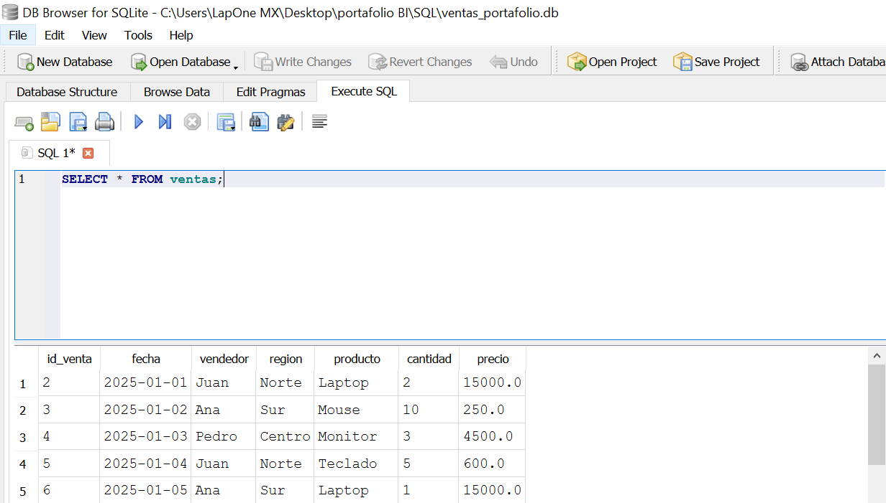

# SQL Proyecto 1 - Análisis de Ventas

## Descripción

Proyecto desarrollado en SQLite para analizar información de ventas mediante consultas SQL enfocadas en responder preguntas de negocio.

Se realizaron análisis de ventas por región, vendedor y producto, además de métricas como ticket promedio y volumen de ventas.

---

## Herramientas Utilizadas

- SQLite
- DB Browser for SQLite
- GitHub

---

## Habilidades Demostradas

- SELECT
- WHERE
- GROUP BY
- ORDER BY
- SUM
- AVG
- COUNT

---

## Preguntas de Negocio Respondidas

- ¿Qué región genera más ventas?
- ¿Qué vendedor tiene el mejor desempeño?
- ¿Qué producto vende más unidades?
- ¿Qué producto genera más ingresos?
- ¿Cuál es el ticket promedio?
- ¿Cuántas ventas se realizaron?

---

## Principales Hallazgos

- La región Norte lidera las ventas totales.
- Juan es el vendedor con mayor facturación.
- Mouse es el producto con más unidades vendidas.
- Laptop es el producto que genera más ingresos.
- El análisis demuestra que el producto más vendido no necesariamente es el más rentable.

---

## Evidencia

### Estructura de la Tabla

---

### Ventas por Región

---

### Ventas por Vendedor

---

### Producto con Más Ingresos

---

### Producto Más Vendido

---

### Ticket Promedio

---

### Total de Ventas

---

### Filtro por Región

---

### Ventas Mayores a un Monto Determinado

---

### Base de Datos Completa

---

## Conclusión

Este proyecto demuestra el uso de consultas SQL para transformar datos transaccionales en información útil para la toma de decisiones comerciales. Se aplicaron técnicas de agregación, filtrado y análisis exploratorio utilizando SQLite.

